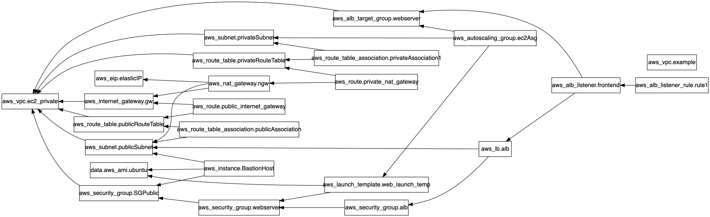

# ec2-private-subnet
Ec2 deployed in private subnet in multi availability zone with ASG and ALB 


#### Project Structure

```
├── userdata.tpl
├── alb_asg.tf
|-- data.tf
|-- network.tf
|-- provider.tf
|-- security.tf
|-- variables.tf
|-- vpc.tf
├── outputs.tf
├── terraform.tfvars
└── variables.tf
```

# Terraform Graph for this repo using site :  https://edotor.net and command terraform graph 
